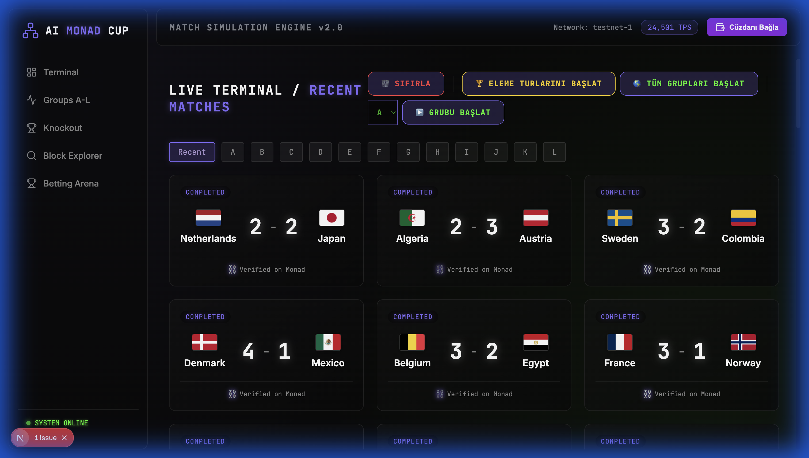
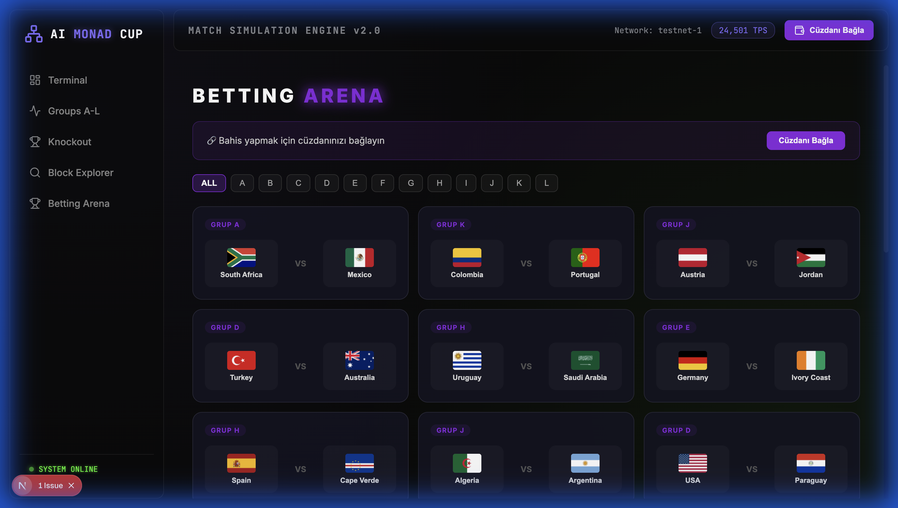

# 🏆 AI MONAD CUP 🚀



> **"Geleceğin futbolu, Monad'ın hızı ve Yapay Zekanın zekasıyla buluşuyor."**

AI Monad Cup, **Monad Testnet** üzerinde çalışan, tamamen yapay zeka tarafından yönetilen ve simüle edilen devrimsel bir Dünya Kupası platformudur. Sadece bir simülasyon değil; on-chain şeffaflığı, Web3 bahis mekanikleri ve GPT destekli canlı anlatımıyla tam kapsamlı bir futbol ekosistemidir.

---

## ✨ Öne Çıkan Özellikler

### 🧠 Yapay Zeka Simülasyon Motoru (AI Engine)
Her maç, her pas ve her şut AI tarafından takımların istatistiklerine ve o anki form durumlarına göre hesaplanır. Hiçbir maç birbirinin aynısı değildir!

### ⛓️ Monad Testnet Gücü
Tüm kritik maç olayları (goller, kartlar, penaltılar) Monad blokzinciri üzerinde on-chain olarak kaydedilir. **24,000+ TPS** hızıyla saniyelik veri işleme ve tam şeffaflık sağlanır.

### 🎲 Web3 Bahis Arenası
Kendi stratejinizi belirleyin! MetaMask ile bağlanın, MON bakiyenizi görün ve favori takımlarınıza bahis yapın. Kazançlar doğrudan cüzdanınıza!

### 🎙️ Dinamik GPT Anlatımı
Maçları sadece skor tabelasından takip etmeyin. GPT destekli canlı anlatım sistemi, her olayı saha kenarındaki bir spiker gibi size aktarır.

---

## 🛠️ Teknoloji Yığını

- **Frontend:** [Next.js 15](https://nextjs.org/) (App Router), React, Lucide Icons
- **Blockchain:** [Monad Testnet](https://monad.xyz/) (Chain ID: 10143)
- **Web3 Entegrasyonu:** Ethers.js, MetaMask API
- **Veritabanı:** Supabase (PostgreSQL)
- **Yapay Zeka:** OpenAI GPT-4o-mini (Match Engine & Commentary)
- **Styling:** Premium Glassmorphism & Neon Design (Custom CSS)

---

## 🚀 Hızlı Başlangıç

### Gereksinimler
- Node.js v18.0 veya üzeri
- MetaMask Tarayıcı Eklentisi
- Monad Testnet MON Token (Faucet üzerinden alabilirsiniz)

### Kurulum

1. **Repo'yu Klonlayın:**
   ```bash
   git clone https://github.com/EnsarEness/Monad-Cup.git
   cd Monad-Cup
   ```

2. **Bağımlılıkları Yükleyin:**
   ```bash
   npm install
   ```

3. **Çevre Değişkenlerini Ayarlayın (`.env.local`):**
   ```env
   NEXT_PUBLIC_SUPABASE_URL=your_supabase_url
   NEXT_PUBLIC_SUPABASE_ANON_KEY=your_supabase_key
   NEXT_PUBLIC_RPC_URL=https://testnet-rpc.monad.xyz
   ```

4. **Projeyi Çalıştırın:**
   ```bash
   npm run dev -- -p 3002
   ```

---

## 📸 Ekran Görüntüleri

### ⚽ Terminal ve Canlı Simülasyon


### 🎰 Bahis Arenası


---

## 🤝 Katkıda Bulunma
Bu proje açık kaynaklıdır ve topluluk katkılarına açıktır. Bir özellik eklemek veya hata bildirmek için lütfen bir Issue oluşturun veya Pull Request gönderin.

---

## 📄 Lisans
Bu proje **MIT** lisansı altında lisanslanmıştır.

---
**DEVELOPED BY TEAM AI MONAD CUP** 🦾
